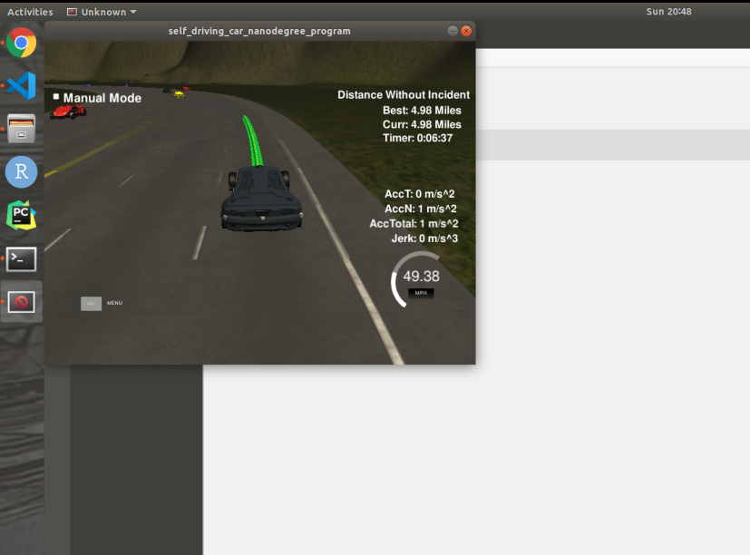

# CarND-Path-Planning-Project<br>
# *Write Up*<br>
## *The following shows how I achieve the rubric points this project requires.*<br>
--------------------------------------------
* ### **The code compiles correctly.**<br>

All the code is inside the *src* file, and can be complied sucessfully. Please note that [*spline.h*](https://kluge.in-chemnitz.de/opensource/spline/) is used and also included in the *src* file. I also push the simulator which is *term3_sim_linux* into this repo.<br>

* ### **The car is able to drive at least 4.32 miles without incident.**<br>

Below is a screenshot from the simulator window in my local computer.<br>
<div align =center>  
<br>
<div align =left>  

* **The car drives according to the speed limit.**<br>
  
To meet the speed limit, I set the the reference speed as 49.5 mph in line 154.
```c++
          } else if (ref_vel < 49.5) {
            ref_vel += 0.224; // Deal with cold start.
          }
```
However, the metric used in the perception module is m/s in this project. When designing the path points, I convert the mph stuff into m/s. See line 466 to 469.
```c++
            double N =
                (target_dist /
                 (0.02 * ref_vel /
                  2.24)); // 0.02 sec to visit next point, and 2.24 miles/h is 1 m/s,
```

* ### **Max Acceleration and Jerk are not Exceeded.**<br>

First to deal with the cold start, I set the reference speed to 0 at the beginning, and increse it by 0.224 every time when main function is called until it meet the speed limit (49.5 mph). That can prevent the car exceed the Max Acceleration at the beginning.<br>
When we decide to decelerate, I decrease the reference speed by 0.224 or 0.448 (emgerency situation) each time when main function being called as well. Please see line 149 to 156.<br>
```c++
          if (too_close) {
            ref_vel -= 0.224; // Deal with the sudden deceleration.
            if (emergency_stop) { // Deal with emergency situation, apply hard break. 
              ref_vel -= 0.224;
            }
          } else if (ref_vel < 49.5) {
            ref_vel += 0.224; // Deal with cold start.
          }
```
To deal with Max Jerk, I use *spline* object to generate smooth trajectories for the car. Each time I set 5 points in the *spline* object, 2 points from the previous path and 3 points from the future path.

* ### **Car does not have collisions.**<br>

To address the collsion danger, I set up 2 flags to indicate the car to decelerate in case of crashing into the car at its front. The first flag is *too_close*, there are 2 situations that *too_close* would be true, as when our car is too close to the car at the front: 1. our car's current position is too close to the next car; 2. our car's trejectory's end point is too close to the next car's predictive position. Each situaton, we need to make our car slow down. The second flag is *emergency_stop*, when this flag is true, that means we are too too close to the next car at the front, then we need to apply bigger deceleration. The criteria for activating *emergency_stop* is our car's current position being too close to the next car. Please see line 108 to 144. A snippet is provided as below:<br>
```c++
              double check_car_s_prime =
                  check_car_s +
                  ((double)prev_size * .02 *
                   check_speed); // Perdict where the car will be in the future.
              if ((check_car_s_prime > car_s) &&
                  ((check_car_s_prime - car_s) < 30)) {
                too_close = true; // Reduce speed.
                prepare_for_change = true;  // Attempt changing lane.  
              } else if ((check_car_s > car_current_s) &&
                         ((check_car_s - car_current_s) < 30)) {
                too_close = true; // Reduce speed.
                prepare_for_change = true; // Attempt changing lane.
              }
              if ((check_car_s > car_current_s) &&
                  ((check_car_s - car_current_s) < 10)) {
                emergency_stop = true;  // To close, apply hard breaking.
              }
```
Besides, we also should think about how to change lane in order to prevent collision. That's we should judege if we can make a lane change from the perception data. I set up 8 scenarios which indicate that our car should not make a lane change: <br>
1. a car is at the lane we are merging into, and it's behind us but its perdictive postion pass our trajectory path's end point;<br> 
2. a car is at the lane we are merging into, and it's in front of us but its perdictive postion is not far enough to our trajectory path's end point;<br>
3. a car is at the lane we are merging into, and it's current s (frenet coordinate) postion is behind ours but it is still close to our current s postion.<br>
4. a car is at the lane we are merging into, and it's current s (frenet coordinate) postion is in front of ours but still close to our current s postion.<br>
5. a car is at the lane we are merging into, and it's not far behind us, but its speed is larger than ours.
6. a car is at the lane we are merging into, and it's not far away from us, but its speed is smaller than ours.
7. a car is at the lane we are merging into, and its predictive postion is behind our trajectory path's end point but still close to it;<br> 
8. a car is at the lane we are merging into, and its predictive postion is at front of our trajectory path's end point but still close to it;<br> 

A code snippet is shown below:<br>
```C++
                  double vx = sensor_fusion[i][3];
                  double vy = sensor_fusion[i][4];
                  double check_speed = sqrt(vx * vx + vy * vy);
                  double check_car_s = sensor_fusion[i][5];
                  double check_car_s_prime =
                      check_car_s + ((double)prev_size * .02 *
                                     check_speed); // Perdict where the car
                                                   // will be in the future.
                  flag = 'r'; // decide if the car can make right turn.
                  if ((check_car_s < car_current_s) &&
                      (check_car_s_prime - car_s > 0)) {
                    flag = 'k';
                    break;
                  } else if ((check_car_s > car_current_s) &&
                             (check_car_s_prime - car_s < 35)) {
                    flag = 'k';
                    break;
                  } else if ((check_car_s > car_current_s) &&
                             (check_car_s < car_current_s + 15)) {
                    flag = 'k';
                    break;
                  } else if ((check_car_s > car_current_s - 15) &&
                             (check_car_s < car_current_s)) {
                    flag = 'k';
                    break;
                  } else if ((check_car_s > car_current_s - 35) &&
                             (check_car_s < car_current_s) &&
                             (check_speed > ref_vel)) {
                    flag = 'k';
                    break;
                  } else if ((check_car_s < car_current_s + 35) &&
                             (check_car_s > car_current_s) &&
                             (check_speed < ref_vel)) {
                    flag = 'k';
                    break;
                  } else if ((check_car_s_prime > car_s) &&
                             (check_car_s_prime - car_s <= 35)) {
                    flag = 'k';
                    break;
                  } else if ((check_car_s_prime < car_s) &&
                             (check_car_s_prime >= car_s - 35)) {
                    flag = 'k';
                    break;
                  }
```
No matter our car is merging into right or left lane, it should go over those 8 condictions to decide if it can really make a turn.<br>

* ### **The car stays in its lane, except for the time between changing lanes.**<br>

I set up a flag to make sure our car will either turn  or keep moving at the same lane. Once the car decides to turn, it will stay at the lane it's merging into. Please see line 370 to 380.
```C++
          switch (flag) {
          case 'l':   // Merge into the left lane.
            lane -= 1;
            flag = 'k'; // Stay into the left lane.
            break;
          case 'r':   // Merge into the right lane.
            lane += 1;
            flag = 'k'; // Stay into the right lane.
          default:
            break;    // Stay at the current lane.
          }
```
Here, *lane* is a parameter taken into account when generate our trajectory. When *lane* is 0, the trajectory would tend to stay or move to the left lane; When *lane* is 1, the trajectory would tend to stay or move to the middle lane; When*lane* is 2, the trajectory would tend to stay or move to the right lane. So once the flag decide which lane we are going to, our car would generate a trajectory on this lane or to this lane.<br>

* ### **The car is able to change lanes**<br>

To change lane, I set up a flag which is *prepare_for_change*. When it's true, our car will go over the 8 conditions I mention above and decide if it can make a lane change. Once it decide to make a lane change, the *lane* parameter will set to the lane we are merging into and the trajectory would be generated right away. I decide 2 scenarios when *prepare_for_change* would be true: 1. The flag *too_close* is true; 2. The car at the front is not too far from us, but its speed is too low comparing to ours. Please see line 125 to 142. 
```C++
if ((check_car_s_prime > car_s) &&
                  ((check_car_s_prime - car_s) < 30)) {
                too_close = true; // Reduce speed.
                prepare_for_change = true;  // Attempt changing line.  
              } else if ((check_car_s > car_current_s) &&
                         ((check_car_s - car_current_s) < 30)) {
                too_close = true; // Reduce speed.
                prepare_for_change = true; // Attempt changing line.
              }
              if ((check_car_s > car_current_s) &&
                  ((check_car_s - car_current_s) < 10)) {
                emergency_stop = true;  // To close, apply hard breaking.
              }
              if ((check_car_s > car_current_s) &&
                  ((check_car_s_prime - car_s) < 60) &&
                  (check_speed < ref_vel - 10)) {
                prepare_for_change = true;  // Attempt changing line.
              }
```
<div align =center> 


<div align =left> 
The car design to turn left first, as in my code, turning left is prior to turning right, but after it turning to left, it detect the front car is close to ours. Then our car move to the right lane. (I think it's Acceptable, but not comfortable for the passengers...)<br>

* ### **There is a reflection on how to generate paths.**

In fact, I use the [*spline.h*](https://kluge.in-chemnitz.de/opensource/spline/) to generate our path. In the course, we have to compute the quintic parameter ourselves, but here *spline* does this for us. What we need to do is set up 5 points in the *spline* object for it to make a trajectory.<br>

In my code, I use 2 points from the pervious path and 3 points in the future path as setup. When we don't have enough pervious points at the beginning, I use the current car's position, and a point behind our car's current postion. The line between these 2 points should point to our car's yaw angle. The 3 points in the future would be set at the 30, 60, 90 meters away from the second point we set, and they should be at the designated lane.<br>

The tricky part is to uniformly set up the paths points on this trajectory. To do so, we use a approximation. Firstly, we compute the euclidean distance between the second point we set a point 30 meters away from it on the trajectory *spline* generates. Then we split this line between those two points into N parts. This N is computed beforehand, making sure that every part is (0.02s * reference_speed) long. Then we can finally get our path points.<br>

One thing to make sure *spline* work correctly is to do some coordinates transformation first. The new coordinate's origin is at the second point we set. The x-axis is at the line which contains the first 2 points, pointing from the first point to the second point. A code snippet is as below:
```C++
for (int i = 0; i < ptsx.size(); i++) {
            // Do coordinate transformation
            double shift_x = ptsx[i] - ref_x;
            double shift_y = ptsy[i] - ref_y;
            ptsx[i] = (shift_x * cos(ref_yaw) + shift_y * sin(ref_yaw));
            ptsy[i] = (shift_y * cos(ref_yaw) - shift_x * sin(ref_yaw));
          }
```

The code for this part is at the line 385 to 486.

